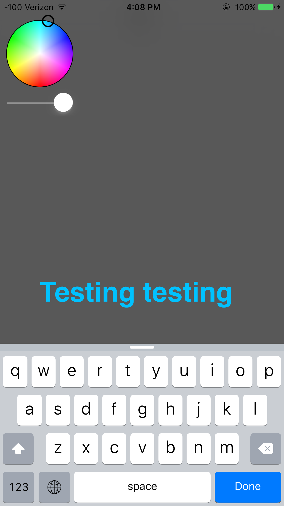

# MessageBoard_iOS
## Intro
An app driven by Parse web services allowing anyone to insert heavily customizable text snippets to a variety of message boards that instantly sync across all connected devices.

## Installation
No additional installation efforts need to be made. The following frameworks are used:
* [Parse](https://www.parse.com) - data server
  
## Images  
#### Text Addition

#### Text movement, rotation etc.

#### Transition to next view

